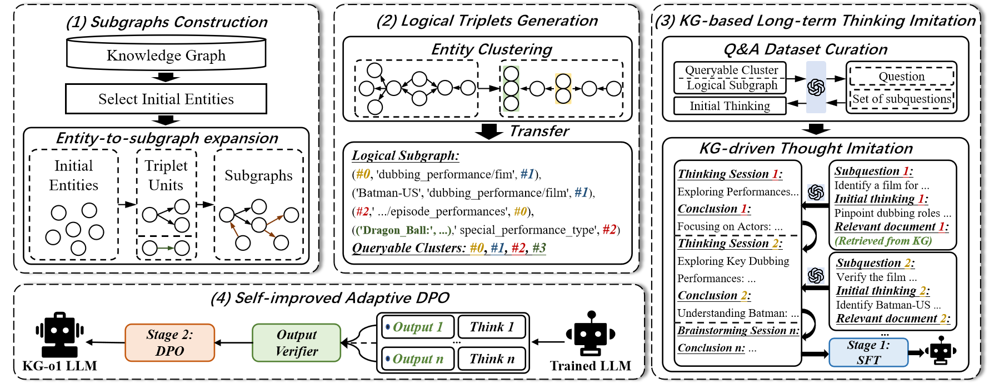

# KG-o1:

## Introduction

Welcome to KG-o1, a two-stage approach that integrates KGs to elevate an LLM to an LRM, enabling it to acquire stronger long-term reasoning capabilities for handling knowledge-intensive multi-hop reasoning tasks in complex scenarios. This repository will contain the KG-o1 series of models, the KG-MHQA SFT dataset and DPO dataset.

## Framework

  

## Example of KG-MHQA.

  

To be continued.